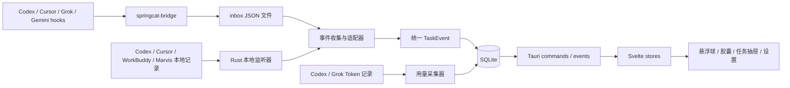

# SpringCat AI

常驻桌面的 AI 任务状态中心。SpringCat 把多个 AI 编程工具的执行状态汇总成一个低干扰的悬浮球与胶囊面板，让你离开对话窗口后，仍能及时看到任务执行、等待处理、完成或失败。

**官网：** [springcat.cn](https://springcat.cn)

> 当前版本为 `0.1.0`，工作面板已经实现；宠物模式仍在规划中，设置页暂不可选。

## 主要功能

- **桌面状态面板**：透明无边框、可置顶，可吸附到屏幕顶部、左侧或右侧；支持悬浮球、状态胶囊和最近任务抽屉。
- **统一任务提醒**：汇总 Codex、Cursor、Grok CLI、Gemini CLI、WorkBuddy 与 Marvis 的开始、进度、等待、完成、失败和取消状态。
- **低干扰通知策略**：支持未读标记、连续完成合并、静音 1 小时和专注模式；可在任务仍在执行时自动临时置顶。
- **一键绑定工具**：在设置页安装、修复、移除并测试各工具的监听配置，启动时会检查并修复已启用的绑定。
- **任务历史与跳转**：本地保存最近任务，支持标记已读、打开任务 deep link，或回到对应的来源应用。
- **用量日历**：从本地结构化日志汇总 Codex 与 Grok CLI 的精确 Token 用量，按日、周、月查看趋势、模型分布与费用估算，并可导出分享图片。
- **可配置的桌面行为**：支持开机启动、默认吸附边、灵动岛兼容布局、外部链接浏览器、历史保留周期和自定义数据目录。
- **Windows 与 macOS 桌面外壳**：仓库包含 Windows NSIS/MSI 和 macOS DMG 的构建配置，以及对应的原生窗口适配。

## 支持的 AI 工具

| 工具 | 任务状态来源 | Token 用量统计 |
|---|---|---|
| Codex 桌面端 / CLI | 本机会话记录 + hooks | 支持 |
| Cursor | hooks + 本地状态纠偏与标题回填 | 待接入 |
| Grok CLI | 全局 hooks | 支持 |
| Gemini CLI | 官方全局 hooks | 暂不支持 |
| WorkBuddy | 只读监听本地会话记录 | 暂不支持 |
| Marvis | 只读监听本地 SQLite/WAL 生命周期 | 支持 |
| DSH Desktop | 只读监听本地会话项目缓存 | 待接入 |

打开 **设置 → AI 工具** 即可启用监听。SpringCat 会合并自己的 hook，不覆盖其他工具已有配置；详细行为和手动配置方式见 [适配器安装文档](./docs/adapters.md)。

## 技术架构



任务主链路为：

```text
工具 hooks / 本地生命周期记录
  → springcat-bridge 或 Rust 本地监听器
  → inbox 文件监听与来源适配
  → 统一 TaskEvent
  → SQLite 去重、折叠与持久化
  → Tauri IPC / event
  → Svelte 状态与桌面面板
```

核心技术栈：

| 层级 | 技术 |
|---|---|
| 桌面外壳 | Tauri 2 |
| 前端 | Svelte 5、TypeScript、Vite |
| 本地核心 | Rust |
| 数据存储 | SQLite（WAL） |
| 文件监听 | `notify` |
| 工具桥接 | 独立 Rust CLI `springcat-bridge` |
| 原生平台适配 | Windows API、AppKit |

事件通道使用本地文件和文件系统通知，不启动本地 HTTP 或 WebSocket 服务。前端只通过 Tauri command/event 与 Rust 核心通信，不直接依赖平台窗口 API。

## 本地优先与隐私

- 设置、任务历史、事件 inbox、日志和用量统计默认只保存在本机。
- 任务库只保留状态、时间、来源、短标题和有限长度的完成摘要等生命周期元数据。
- 完整对话、推理、工具参数与结果、项目源代码和凭证不会写入 SpringCat 的 SQLite。
- 用量采集只读取工具日志中的结构化 Token 字段，不保存 prompt 或回复正文。
- 数据目录可在 **设置 → 常规 → 本地存储** 中修改；切换时会复制已有历史，重启后生效。

## 开发

需要 Node.js、pnpm、Rust stable，以及 Tauri 2 对应平台的系统构建依赖。

```bash
pnpm install
```

浏览器演示（不创建桌面悬浮窗）：

```bash
pnpm dev
```

启动桌面应用。开发脚本会先构建 `springcat-bridge`：

```bash
pnpm tauri dev
```

常用命令：

| 命令 | 用途 |
|---|---|
| `pnpm check` | Svelte / TypeScript 静态检查 |
| `pnpm test` | 运行前端 Vitest 测试 |
| `pnpm test:rust` | 运行 Rust 测试 |
| `pnpm build` | 构建前端产物 |
| `pnpm bridge:build` | 构建 release 版事件桥 |
| `pnpm package:windows` | 在 Windows 构建 NSIS 与 MSI 安装包 |
| `pnpm package:macos` | 在 macOS 构建 DMG |

桌面应用通过托盘菜单退出；托盘图标也可用于显示或隐藏面板、静音、切换专注模式和打开设置。

## 项目结构

```text
springcat-ai/
├─ src/
│  ├─ app/                    # 应用外壳、前端状态与面板交互
│  ├─ components/             # 工作面板、任务抽屉、设置与用量日历
│  ├─ domain/                 # TS 领域模型与纯状态策略
│  └─ services/               # Tauri IPC 封装
├─ src-tauri/
│  ├─ src/domain/             # Rust 领域模型
│  ├─ src/adapters/           # 各 AI 工具载荷适配器
│  ├─ src/marvis_monitor.rs   # Marvis SQLite/WAL 生命周期与用量监听
│  ├─ src/event_collector.rs  # inbox 监听与任务事件主链路
│  ├─ src/repository.rs       # SQLite 任务与用量仓库
│  ├─ src/usage_collector.rs  # 本地 Token 用量采集
│  ├─ src/windows.rs          # 窗口布局、拖动与吸附
│  └─ src/platform/           # Windows / macOS 原生能力
├─ bridge/                    # springcat-bridge Rust CLI
├─ tests/fixtures/            # 适配器与异常事件样本
├─ scripts/                   # 安装包资源等工程脚本
└─ docs/                      # 产品、实现与适配器文档
```

## 更多文档

- [项目描述](./docs/项目描述.md)
- [适配器安装](./docs/adapters.md)
- [实现路线](./docs/springcat-ai-v1.md)
- [工程记录](./docs/dev-notes.md)
