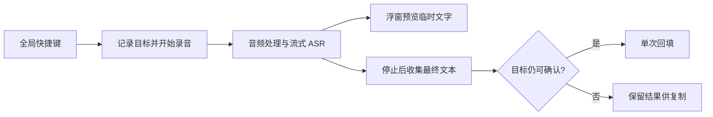

# Windows 语音输入实施方案

编写日期：2026-09-17。状态：技术调研与实施建议，尚未开发、尚未实测。用户已确认 Windows 桌面；其余按中文为主、夹杂英文术语、允许联网、先个人使用再小范围内测来规划。

## 1. 建议做成什么

第一版是一款系统托盘中的语音输入工具：在目标输入框放好光标，按快捷键开始说话，再按一次结束，识别文字后填入原输入框。按 Esc 取消；失败时保留当前结果供复制。默认单次不超过 60 秒。

建议先完成“准确转写 + 常用软件稳定回填”，把去口头禅、改口修正和语气润色作为可选增强。Typeless 官方展示了这些整理能力，但这不代表复现基础语音输入必须先实现它们，也不能从官网推断其内部模型或架构。[Typeless 功能说明](https://www.typeless.com/)

第一版包含：可配置全局快捷键、麦克风选择、录音状态浮窗、流式识别与临时预览、最终文本回填、取消与失败恢复、基础标点、个人热词。

暂不纳入：翻译、语音问答、会议录音、说话人分离、自动发消息、跨设备同步、持续唤醒、完整 Windows 输入法、训练自有模型。离线识别等第一版验证后再决定。

## 2. 开始前准备什么

### 产品与验收材料

- 选择 5 个真实目标应用及输入场景，例如记事本、浏览器 textarea、微信聊天框、VS Code 普通文本编辑、Word 文档。支持范围以实测清单为准。
- 准备 50–100 条真实口述，覆盖 5–60 秒、普通中文、中英混合、数字日期、人名项目名、停顿、口音和环境噪声；人工校对参考文本，至少保留 20 条不参与调参。
- 准备 20–50 个常用词，例如项目名、客户名、技术术语；词典用于识别提示，不能假定每次都生效。
- 明确默认行为：按一次开始/再按一次结束；只填入，不触发发送；焦点变动时保留结果等待用户处理。
- 邀请 5–10 位内测者，尽量覆盖笔记本内置麦克风、USB 麦克风及蓝牙耳机。

### 设备与开发环境

云端路线使用现有 Windows 电脑及麦克风即可，不必为第一版购买 GPU 或训练服务器。准备一台干净测试机或虚拟机验证安装；真实音频设备仍需在实体电脑上测试。

如果加入当前 SpringCat，可以复用已经存在的 Tauri 2、Svelte 5、TypeScript、Rust、SQLite 和 Windows 原生接口依赖。此判断来自本地 package.json 与 src-tauri/Cargo.toml；没有审计现有功能是否全部可复用。

新增能力主要在 Rust：音频采集、ASR 连接、会话管理、Windows 回填。Svelte 负责设置、录音状态和结果展示。开发环境需具备项目原有 Node/Rust 构建链和 Windows 构建工具。

### 账号与运行费用

开通一个可用的流式 ASR 服务账号，取得开发密钥，确认地域、模型权限、余额、并发限制。评测时可以再开一家做对照；第一版上线只接入胜出的服务即可。

个人原型可使用自己的密钥，由原生层从系统凭据存储读取。分发给他人时，用自己的轻量服务端保管服务商密钥并做鉴权、限流和额度控制；不要把运营方长期密钥打包进安装程序。客户端直连须以供应商支持且权限受限的短期凭据为前提，否则由服务端中转。

## 3. 推荐技术路线

### 桌面端：复用现有 Tauri + Svelte + Rust

- 全局快捷键：Tauri global-shortcut 插件；处理占用冲突和重复触发。第一版使用切换式录音，按住说话作为后续交互优化。[Tauri 官方文档](https://v2.tauri.app/plugin/global-shortcut/)
- 音频：Rust 的 CPAL，Windows 使用 WASAPI 后端；先枚举设备支持的格式，再按识别服务要求重采样、转单声道和编码。不能假定所有麦克风直接输出 16 kHz PCM。[CPAL 官方仓库](https://github.com/RustAudio/cpal)
- 状态与结果：Rust 管理录音生命周期，Svelte 展示不抢焦点的浮层。长耗时识别不能阻塞界面。
- 词典与设置：复用本地存储；密钥与普通设置分离。结果历史可选，默认不持久保存音频。
- 回填：封装独立 Windows 模块，使用剪贴板粘贴或 Unicode 输入，并根据实际应用测试决定默认策略。

这次只做 Windows；如果未来要做 macOS，可以复用界面和部分业务代码，但系统权限、录音及跨应用输入需单独适配。

### 识别：国内云端流式 ASR 优先

建议先测阿里百炼的当前流式 ASR，使用同一批录音与火山引擎流式 ASR 对照。阿里当前文档推荐 qwen-audio-3.0-asr-flash-streaming，支持流式输入/输出、热词与上下文；选型应以自己的中文与术语实测结果为准。[阿里官方选型](https://help.aliyun.com/zh/model-studio/asr-model)、[热词说明](https://help.aliyun.com/zh/model-studio/improve-asr-accuracy)、[火山 ASR 产品](https://www.volcengine.com/product/asr)

“实时识别”和“实时写入目标软件”是两件事。第一版边说边上传，在浮窗中显示临时结果；停止后等待最终结果，再一次性填入目标软件。不要把会不断改写的临时识别结果直接打进微信或编辑器。

基础转写不依赖额外的大语言模型。标点和热词优先使用 ASR 的能力；不要用语言模型补写没听清的内容。

离线备选是 whisper.cpp：可在 Windows 上本地运行，但要承担模型下载、硬件性能差异和安装体积；官方实时示例仍需要分块处理与去重等工程工作。先在目标低配电脑上评测，再承诺体验。[whisper.cpp 官方仓库](https://github.com/ggml-org/whisper.cpp)

## 4. 工作链路与关键约束

会话至少区分待机、录音中、等待最终结果、回填中、完成、取消、失败。每次录音有独立会话 ID；取消后忽略迟到结果；重连和重复最终事件不能导致重复回填。达到时长上限时提示并正常结束会话。

### Windows 回填是需要单独验证的模块

1. 录音开始记录目标窗口，浮层不抢焦点。回填前检查目标窗口及可识别的焦点控件；只比对窗口句柄并不足以发现同一窗口内换了输入框。目标不确定时停止自动回填。
2. 等快捷键修饰键释放后再注入。中文使用 Unicode 文本，测试中文输入法正在组词、中英切换、选中文本和换行，不模拟拼音按键。
3. 若使用剪贴板粘贴，先定义备份/恢复策略。剪贴板有图片、富文本等多种格式，不能把“恢复一个字符串”当成完整恢复；用户期间复制了新内容时不能覆盖它。无法安全处理时提供显式复制。
4. 不把 SendInput 返回成功当成目标软件已经收到正确文本；兼容测试必须检查实际落入的内容。
5. 普通权限进程向管理员窗口注入受 UIPI 限制。第一版支持普通权限应用；管理员窗口、安全桌面、密码框及特殊远程场景应拒绝自动回填或不列入支持范围。不要靠默认管理员运行来覆盖这些限制。[微软 SendInput](https://learn.microsoft.com/en-us/windows/win32/api/winuser/nf-winuser-sendinput)
6. Windows 限制程序强行切回前台，因此不依赖强制抢焦点恢复输入位置。任何情况下都不自动按 Enter 发送消息或执行终端命令。[微软前台窗口限制](https://learn.microsoft.com/en-us/windows/win32/api/winuser/nf-winuser-setforegroundwindow)

### 音频与数据处理

显示明确录音状态，只在用户启动后采集麦克风。无语音或只有噪声时不提交凭空生成的文字。区分拒绝权限、设备断开、网络断开、余额不足和服务超时，让用户知道如何恢复。

音频可暂存在当前会话内存中用于有限重试，结束后清理；历史与诊断默认不保存正文和音频。记录服务耗时、错误码和会话状态即可。界面说明云端识别需要上传音频；服务商的数据保留政策需要单独核实，不将“应用不保存”表述为“整条链路零留存”。

## 5. 分阶段实施

以下为一名熟悉现有技术栈的开发者全职工作的估算，不是工期承诺。各阶段达到验收条件再继续；实际准确率、网络环境和应用兼容性会影响工期。

### 阶段 0：冻结范围与建立样本，1–2 个工作日

**完成内容：** 确定 5 个目标应用、快捷键行为、中文和英文术语范围、60 秒上限、个人密钥或服务端接入模式；准备 50–100 条带参考文字的语料，标注噪声/术语/数字等分组。

**交付物：** 一页功能清单、语料和参考答案、兼容测试清单、初始验收指标。

**验收：** 每个范围项都有明确成功/失败行为；评测集可以重复运行；至少 20 条录音作为独立验收集。用少量固定文字提前试验系统回填，暴露高风险应用。

### 阶段 1：验证识别效果，2–3 个工作日

**完成内容：** 做一个最小录音/识别原型，跑通云端接口；两家候选服务使用相同录音和相同归一化标准评测；记录错误率、关键实体准确率、请求耗时和实际调用量。

**交付物：** 可运行的 ASR 原型、评测结果、最终服务商选择及理由。

**验收：** 以安静普通话 CER ≤5% 作为初始目标，同时单列术语、金额、日期、否定词错误。语料不足时不声称具备整体准确率保证。测试静音、咳嗽和键盘声；若识别或网络体验不满足需求，在这一阶段更换服务或调整范围。

### 阶段 2：打通桌面闭环，3–5 个工作日

**完成内容：** 全局快捷键、录音采集、状态浮层、开始/结束/取消、最终结果回填；临时结果仅在浮窗显示；检查焦点及修饰键释放，处理无目标和不可输入场景。

**交付物：** 可以在常用软件中完成一次完整语音输入的开发版本。

**验收：** 5 个目标应用各完成 20 次普通输入，逐次核对实际文本；另外测试切换窗口、同窗口换输入框、中文 IME、取消与重复热键。错窗口输入、重复插入、自动发送在测试中均为 0；未支持的场景保留文本并明确提示。

### 阶段 3：达到日常可用 MVP，4–6 个工作日

**完成内容：** 处理断网、超时、麦克风拔插、蓝牙切换、无声、权限拒绝；控制重试与最终事件去重；加入个人词典、设备选择、快捷键设置、错误恢复和数据清理。

**交付物：** 可每天使用的 MVP，以及评测、性能和兼容结果。

**验收目标：** 累计 300 次测试会话；支持范围内有效回填成功率 ≥99%，误写、自动发送、重复回填为 0；5–30 秒录音在约定网络条件下，从用户停止到最终文字填入的 p95 ≤3 秒。31–60 秒及噪声场景单独报告，不混进平均数掩盖问题。失败结果有明确状态，已有最终文本可找回。

这些是计划验收门槛，不是本次已经测出的性能。达到此阶段即可交付“只做语音输入”的核心功能。

### 阶段 4：小范围内测与分发，5–8 个工作日

**完成内容：** 邀请 5–10 人连续使用约 5 天；修复高频兼容问题；验证安装、升级、卸载、开机启动选项。若多人共用服务额度，完成最小鉴权网关、配额和服务商密钥管理。外部分发前准备代码签名与更新渠道。

**交付物：** 安装包、已验证的应用/系统支持清单、已知限制、内测反馈与发布检查结果。

**验收：** 干净 Windows 环境能装好并首次使用；升级不丢配置；密钥未进入安装包及日志；额度异常有反馈；内测无未解决的错窗写入、自动发送、录音无法停止等阻断问题。测试者是否持续愿意使用，比单次演示成功更重要。

累计阶段 0–3：10–16 个工作日，按周排期约 2–4 周。累计阶段 0–4：15–24 个工作日，约 3–5 周。证书获取、服务审核和需求新增等外部等待另计。

### 阶段 5：可选的智能整理，额外 3–5 个工作日

只有确实需要更接近 Typeless 的整理体验时再做：去掉无意义口头禅和重复，根据明确改口保留最终表达，并可整理列表。通过可关闭的文本处理步骤实现，不与 ASR 效果混为一谈。

例：“嗯，我们周三开会，不对，周四下午三点。”原样模式保留完整表达；整理模式可输出“我们周四下午三点开会。”

**交付物：** “原样转写/智能整理”开关、可找回的原始转写、整理前后对照评测。

**验收：** 对人名、金额、时间、代码、否定词和改口建立专门案例；整理不增加新事实。检测到风险或处理超时时回退原始转写。语义是否改变需人工检查；不能仅凭规则检测通过就保证没有变义。

## 6. 怎样判断做得好不好

- **中文字符错误率 CER：**（替换数 + 删除数 + 插入数）÷ 参考文本字符数。固定简繁、空格和标点处理规则；数字另做严格评测，不能靠归一化掩盖金额错误。
- **关键实体准确率：** 人名、项目名、英文术语、数字日期分别统计，不能只给一个整体“准确率”。
- **可直接使用比例：** 最终文字无需人工修改的会话占比，用于衡量真实节省的时间。
- **延迟：** 首个可见结果、停止到最终结果、停止到实际回填分别记录 p50/p95；p95 表示约 95% 的样本耗时不超过该值。
- **回填成功率：** 分母是支持范围内、有效且目标未变化的输入尝试；网络失败另外纳入端到端完成率，不能通过只统计成功识别会话掩盖故障。焦点变化、拒权等负例统计为是否正确停止并保留结果。
- **错误底线：** 取消后继续写入、错窗写入、重复回填、自动发送分别计数；发现一个也应优先修复。

## 7. 费用如何估算

截至本次查询，阿里百炼华北 2（北京）qwen-audio-3.0-asr-flash-streaming 公开按量价格为 0.00033 元/输入音频秒，输出不计费，即 1.188 元/小时。[官方价格页](https://help.aliyun.com/zh/model-studio/model-pricing)

按每天 30 分钟、每月 30 天计算：15 小时 × 1.188 元 = **17.82 元/人/月纯 ASR 调用费**。这是忽略免费额度、优惠和请求重试的预算示例；100 人同等用量约 1,782 元/月，1,000 人约 17,820 元/月。

总运行成本还包含服务端、网络、可选智能整理、日志监控和软件分发维护；开发人力单独计算。录音中的静音和重试可能增加可计费时长。不同模型、地域、账户额度和套餐价格不同，接入时再次核实。不要把促销包或免费额度当成长期零成本。

个人验证可以先设置 50–100 元调用预算上限，再用实际音频小时数校准；这是一项预算建议，不代表必须预充值该金额。

## 8. 最先执行的三个任务

1. 整理 50 条真实语音样本，选定 5 个常用应用和输入框。
2. 并行验证“录音到准确文字”与“固定文字可靠填入目标应用”。
3. 两条链路通过后合并为“快捷键 → 说话 → 再按结束 → 文字落入输入框”的第一条完整流程。

本方案不要求先购买 GPU、不要求训练模型、不要求同时建设完整账号/订阅体系。第一轮投入应优先回答：识别是否够准、等待是否够短、回填是否可靠。
